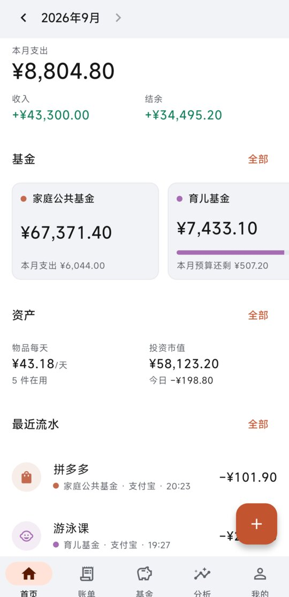
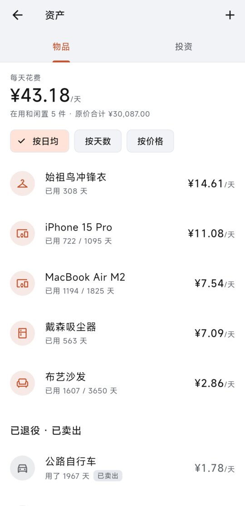
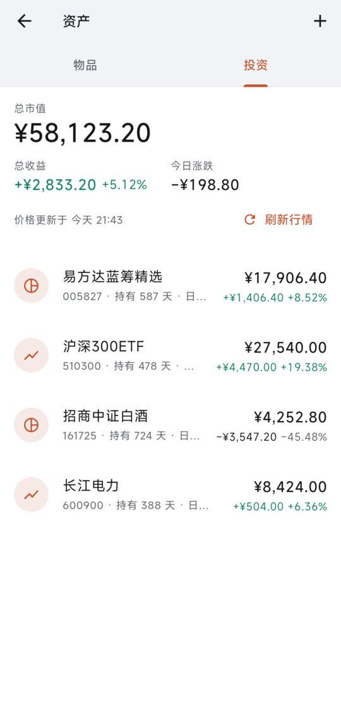
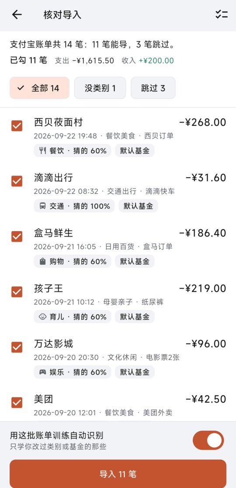
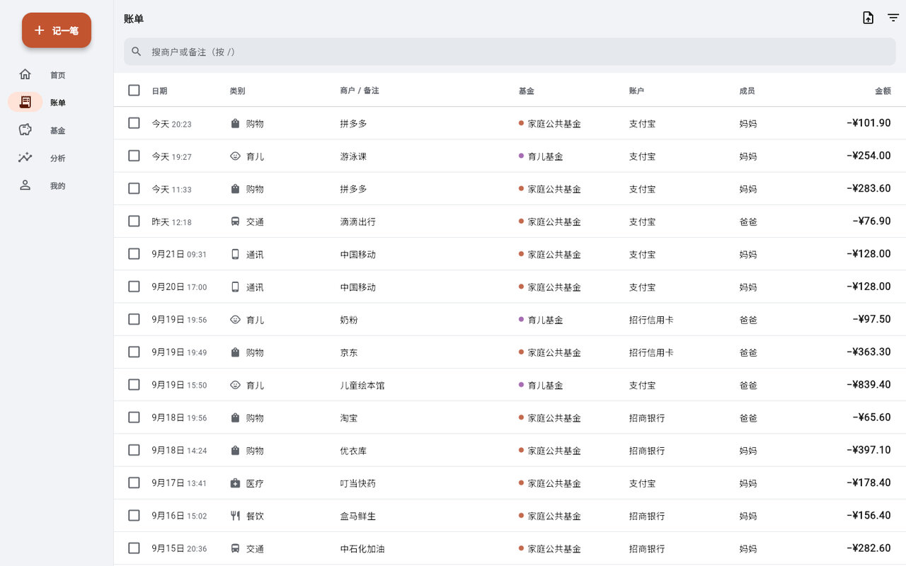
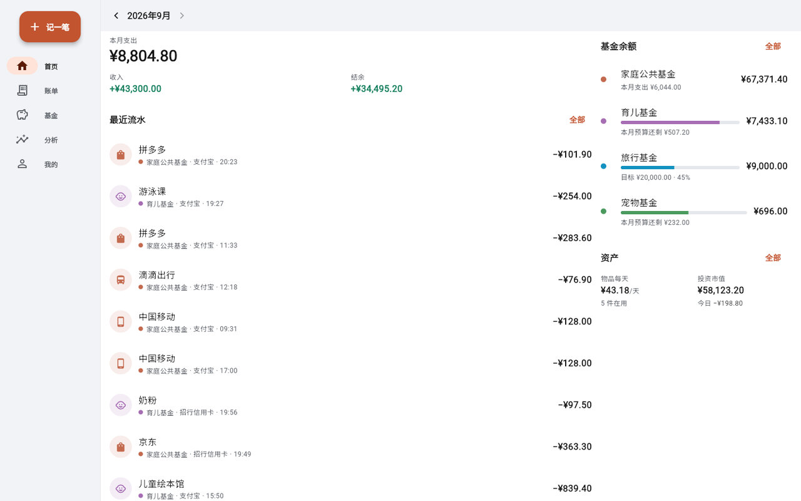
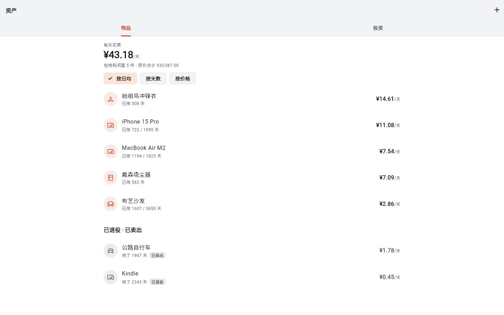
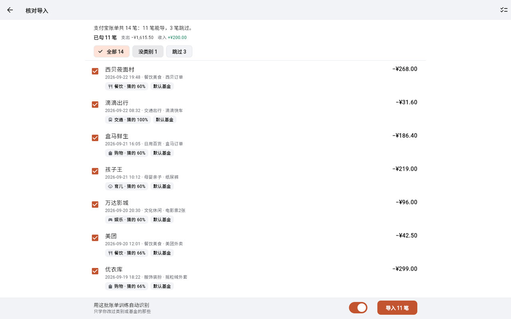

# famledger（家账）

[](https://github.com/shimmerjordan/famledger/actions/workflows/test.yml)
[](https://github.com/shimmerjordan/famledger/releases/latest)
[](LICENSE)

自托管的家庭账本。一个容器、一个端口（48090）、一个 SQLite 文件；Android、iOS、网页共用一份 Flutter 代码。

<p align="center">
  
  
  
  
</p>



## 功能

- **账户 × 基金**：账户记钱在哪（银行卡、支付宝…），基金记钱归谁用（育儿、宠物、旅行…）。基金间拨款不动账户余额。
- **自动记账**（Android）：读支付宝、微信、银行的支付通知直接入账，在通知栏点「正确 / 修改… / 撤销」。iOS 只能走分享、快捷指令或剪贴板。
- **导入账单**：支付宝 CSV、微信 XLSX、通用模板；付款短信、通知的文字也能直接粘贴进来。导入前能逐行改类别，重复的自动跳过。
- **资产**：物品按「(买价 − 卖价) ÷ 用了几天」算日均成本；基金、股票持仓自动拉行情，取不到就手填价格。持仓市值计入净资产。
- **网页版**：宽屏账单表格，支持多选批量改类别、基金，批量删除；快捷键 `N` 记一笔、`/` 搜索、`Delete` 删除。导入和资产管理在网页上也能做。
- **AI**：月报、问答。能接 cc-trans、硅基流动、DeepSeek、Ollama 等；自动记账识别不准时，可以交给本地或远程模型兜底。
- **备份**：定时加密备份到 WebDAV（坚果云等），可以一键恢复。

<p align="center">
  
  
</p>

## 部署

```bash
docker compose -f deploy/docker-compose.yml up -d
```

打开 `http://<NAS 内网 IP>:48090/` 按首启向导建家庭和管理员。升级：`pull` 之后再 `up -d`。

- 数据在容器的 `/data` 里，有两个文件：`famledger.db` 和 `secret.key`。**`secret.key` 要和数据库一起备份**，丢了它全家要重新登录，库里加密存的密钥也解不开了。
- 数据想放到自己的目录，用 `FL_DATA_PATH=<目录>` 启动就行。目录不用先建也不用 chown，容器会自动把属主改成 1000。
- **只能用本地磁盘**，不要挂 NFS/SMB，SQLite 在网络盘上可能坏库。
- 公网访问用 Cloudflare Tunnel，配置示例见 [`deploy/cloudflared-ingress.example.yml`](deploy/cloudflared-ingress.example.yml)。
- 要是先暴露到公网再初始化，务必设置 `SETUP_TOKEN`，否则谁先打开谁就是管理员。
- 改了代码想自己构建：`./scripts/build-web.sh && docker compose -f deploy/docker-compose.build.yml up -d --build`。机器上没装 Flutter 的话，改用 `deploy/Dockerfile.full`。

| 变量 | 默认 | 说明 |
|---|---|---|
| `TZ` | `Asia/Shanghai` | 统计按自然月切，时区必须对 |
| `TRUST_PROXY` | `1` | 在隧道或反代后面保持 1；局域网直连、前面没有反代时**改成 0**，否则限流能被伪造的请求头绕过 |
| `SETUP_TOKEN` | 空 | 首次初始化的口令 |
| `FL_PORT` / `FL_DATA_PATH` | `48090` / 命名卷 | compose 用：宿主机端口、数据目录 |
| `PUID` / `PGID` | `1000` | 服务以哪个用户运行，数据目录的属主也会改成它 |
| `LOGIN_PER_MIN` / `AI_PER_MIN` / `AI_MAX_STREAMS` | `10` / `30` / `4` | 登录、AI 限流 |
| `CORS_ORIGINS` | 空 | 只有网页版部署在另一个域名时才需要 |
| `LOG_LEVEL` | `info` | 设成 `debug` 会打请求日志 |

## 手机 App

- **Android**：装 [Release](https://github.com/shimmerjordan/famledger/releases/latest) 里的 APK，服务器地址填 `http://<内网 IP>:48090`（Tailscale 地址也行）。然后到「我的 → 自动记账」开通知使用权；MIUI 还要打开自启动，省电策略设成「无限制」。
- 通知栏里点「修改…」可以直接打字，按空格分段：`宠物 35 给猫买粮` 表示基金改成宠物、金额改成 35、备注写「给猫买粮」。
- 装了短信转发器、MacroDroid 之类的通知转发 App，它们可能把结果通知吞掉，不过流水照样会记上。把 `com.famledger.app` 加进它们的排除名单就好。
- **iOS**：系统不让读别的 App 的通知。首次构建的 Xcode 步骤见 [`docs/ios.md`](docs/ios.md)（iOS 原生代码还没编译验证过）。

## 导入账单

入口在「我的 → 导入账单」，网页版和手机都有。

| 来源 | 做法 |
|---|---|
| 支付宝 | 账单 → 右上角「…」→ 开具交易流水证明 → 用于个人对账，解压邮件附件得到 CSV |
| 微信 | 我 → 服务 → 钱包 → 账单 → 常见问题 → 下载账单 → 用于个人对账，解压得到 XLSX |
| 其他 | 在导入页下载通用模板，按格式填好再选文件 |
| 短信、通知 | 点「粘贴导入」，把文字粘进来，空行隔开，一段算一笔 |

预览时会自动猜类别，导入的数据越多猜得越准。已经记过的流水会标成重复，默认跳过。

<p align="center"></p>

## 开发

```bash
cd server && npm test                          # 零依赖，Node ≥ 22.13
cd app && flutter analyze && flutter test && flutter build web --release
./scripts/dev.sh                               # 本机起服务端，数据在 server/data/
./scripts/e2e-android.sh                       # Android 真机端到端测试
```

- **CI**：push 自动跑 `test.yml`。发布用 `build.yml`，要在 Actions 里手动触发：推 GHCR 镜像、打 APK、建 Release。版本号取自 [`CHANGELOG.md`](CHANGELOG.md)。
- **已知限制**：iOS 原生代码没编译验证过；APK 用 debug 密钥签名，只能侧载；一次部署只服务一个家庭，也不做多币种换算。

产品定位与视觉规则见 [`PRODUCT.md`](PRODUCT.md)、[`DESIGN.md`](DESIGN.md)。
